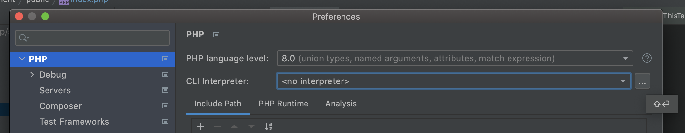
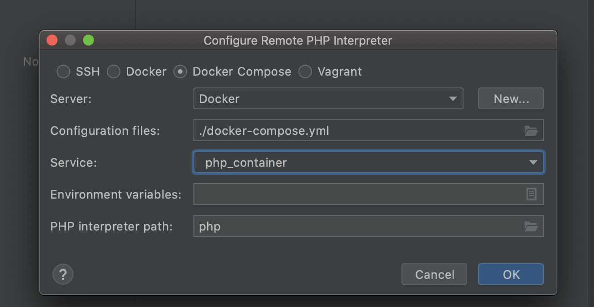
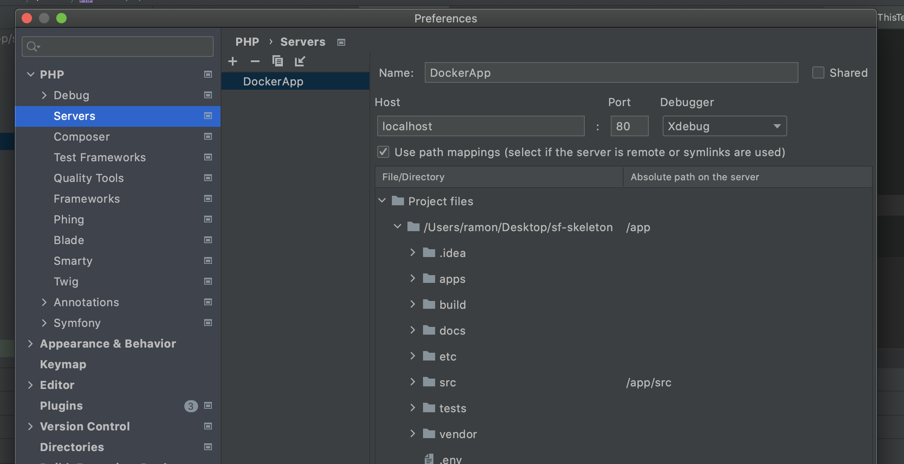

# Installation
Run `make build` in order to install all application dependencies (you must have Docker installed).

For more commands, type `make help`

### Enabling `xDebug` in phpStorm
1. Go to Preferences -> PHP and select PHP 8.0 version

2. Click on `...` to create a CLI interpreter
   
   
3. Create the CLI interpreter by selecting the following parameters:
- Type: Docker compose
- Server: `Docker`
- Configuration files: `./docker-compose.yml`
- Service: `php_container`  
  

4. Go to Preferences -> PHP -> Debug -> Servers to create a new one:
- Name: `DockerApp`
- Host: `localhost` (Port and Debugger should automagically be detected)
- Make sure you check the `Use path mappings` options
- Map the folders to the ones that belong to the Docker container
    - **PROJECT_DIR**: should be mapped to `app`
    - **src**: should be mapped to `app/src`
      

